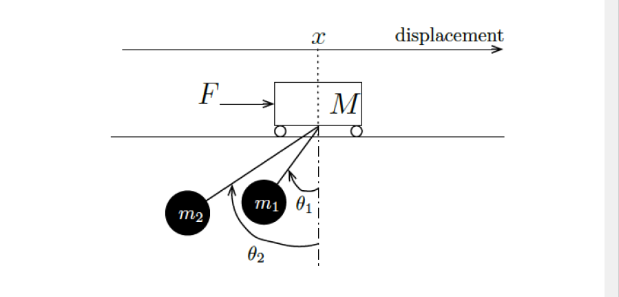

# Controlling a Double Pendulum System on a Moving Cart

**Task:**  to design a controller that can stabilize a double pendulum system, attached to a horizontally moving cart.

Through this project, we explore several core concepts of Control Theory: State Space Representation, Nonlinear System Design, Linear Quadratic Regulator (LQR) Controller, Linear Quadratic Tracker (LQT) Controller and Luenberger Observer.  

The cart  moves along a one-dimensional track. It behaves as a frictionless cart with mass M actuated by an external force F that constitutes the input of the system. There are two loads suspended from cables attached to the crane. The loads have mass m1 and m2, and the lengths of the cables are l1 and l2, respectively. The following figure depicts the crane and associated variables used throughout this project.

  

## Summary

- **Part A:** We use Eurler-Lagrange to obtain the equations of motion for the system and the corresponding nonlinear state-space representation
- **Part B:** System will be linearized about the equilibrium point specified at x=0 and 𝜃1=0 and 𝜃2=0. We assume that 𝜃 values are very small
- **Part C:** We calculate the Controllability of the system by assessing the Matrix Rank.
- **Part D:** A LQR controller is built using the LQR Cost Function, and Riccati Equations.
- **Part E:** We find and compare Observability for a system in each of 4 output cases.
- **Part F:** The Luenberger Observer is implemented for the cases where system is Observable. We simulate the response to I.C. and Unit steps
- **Part G:** A LQG controller is built and tested on a linearized System.

A more detailed explanation of my work can be found in the following report: [Final Project Report](Final_Project_Report.pdf).

## Support
For any questions, email me at jaisharm@umd.edu
